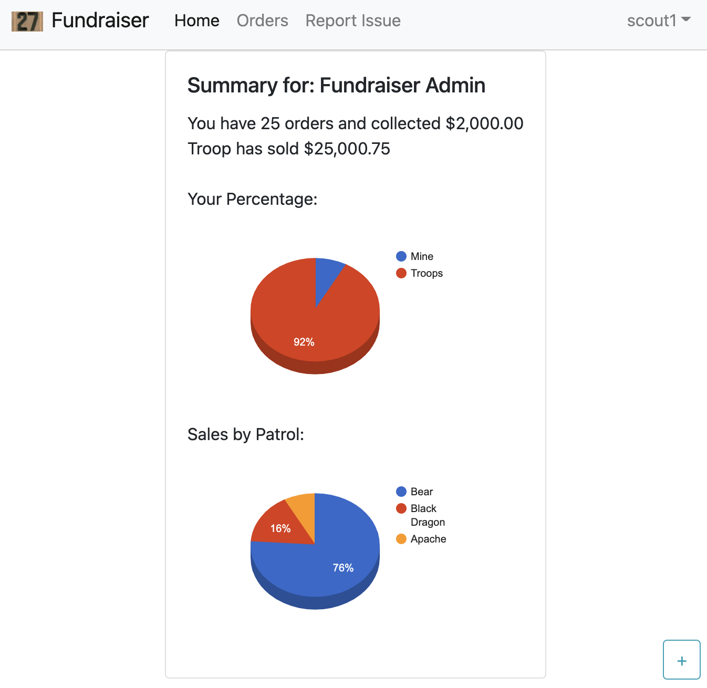
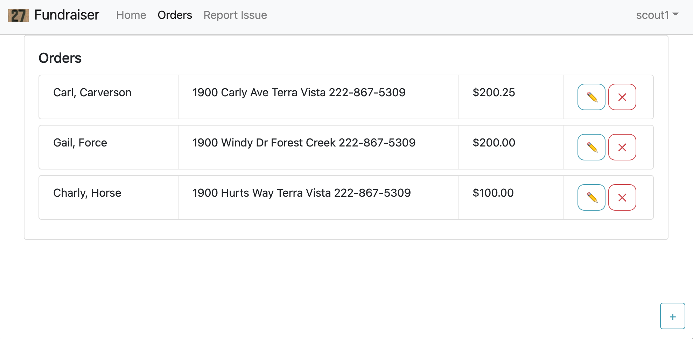
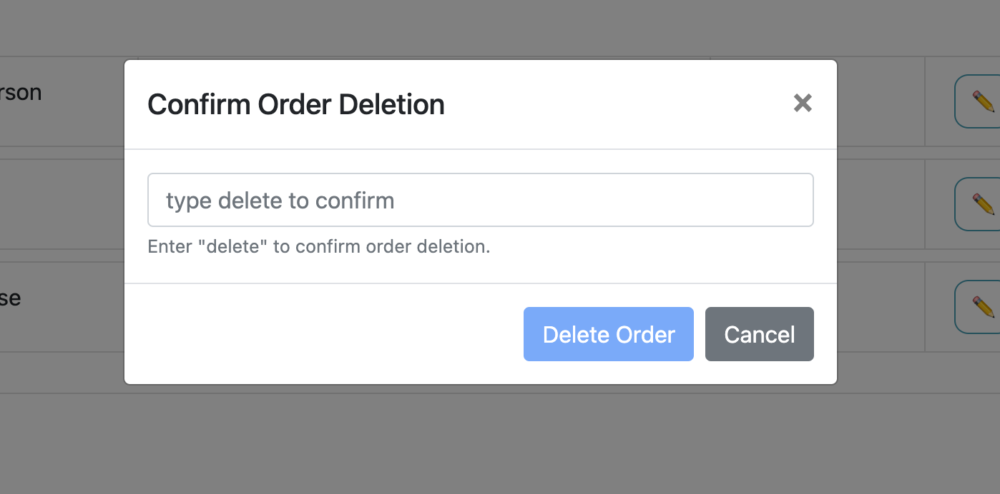
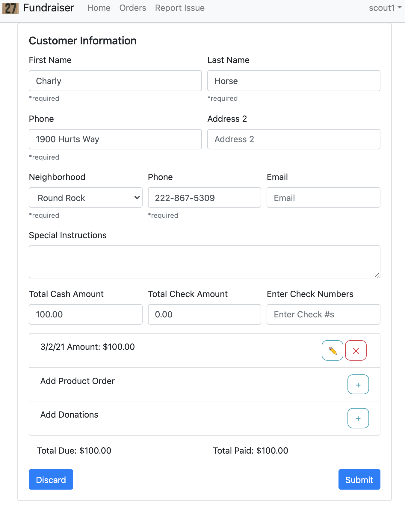
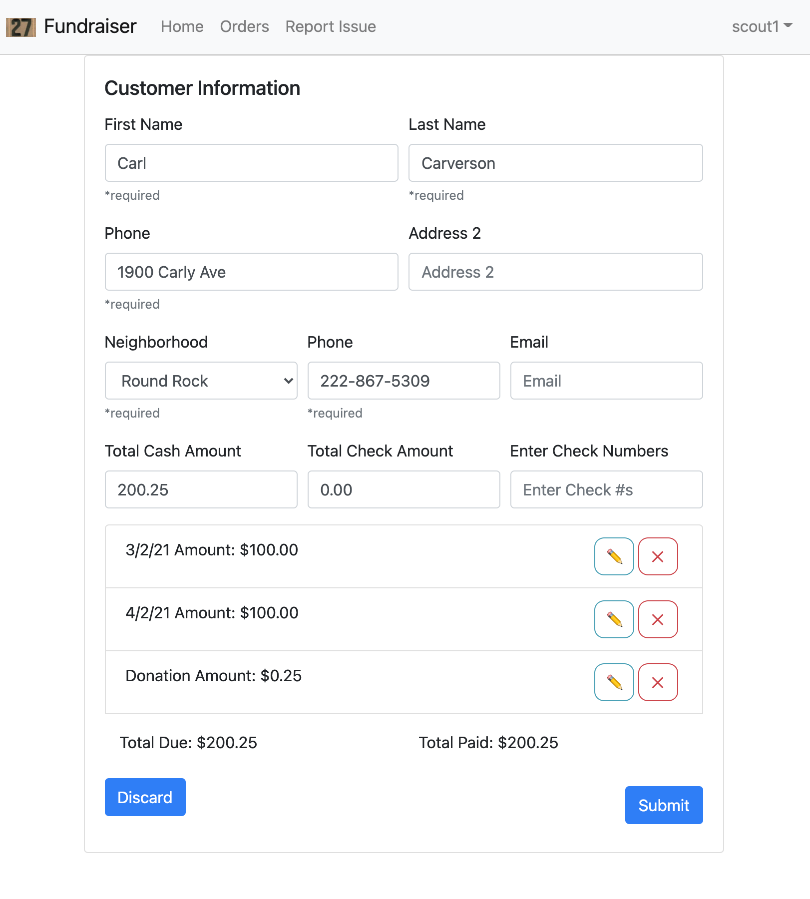
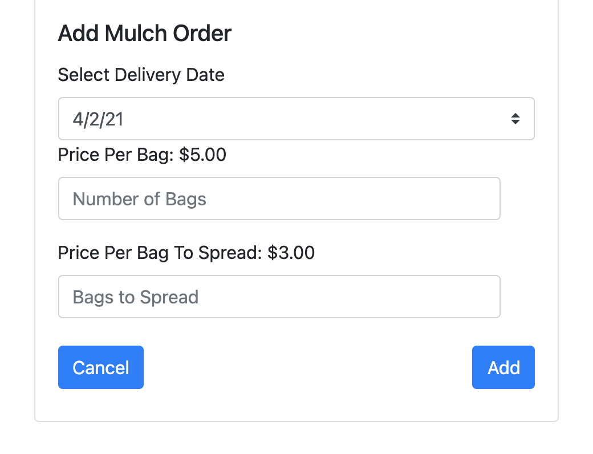
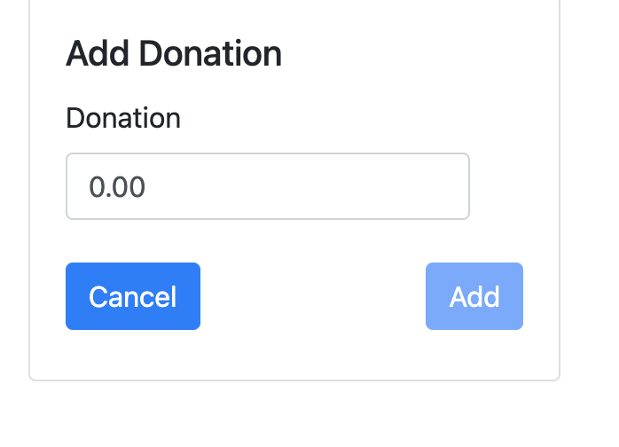

# User Manual for T27 Fundraising App V2.0

This system is a ground up replacement of the previous system. Primary design goals are to be usable for all Troop 27 fundraising efforts and support mobile as well as desktop environments.

Notable Enhancements:
- Usable from mobile devices
- Progressive Web App which means that it is able to be installed and launched like a regular app for both phone and dekstop
- Initial releases has been tested with latest Firefox/Chrome browsers.  MS Edge and Safari desktop browser support will be coming. (Internet Explorer will not be)
- Support for more than just Mulch fundraising efforts
- Enhanced control for switching between fundraiser activities.

# How to get there
_TBD: Add Link_

# Authentication
As in prevous years you will need to get your Username and Password from the Fundraising Cooredinator.  When you first launch the app if you have not recently authenticated, then you will land on this Sign On page:

Enter your given username and password and click the Submit button.  This will take to you the Summary page

# Main/Summary page
After you sign in the first page you will wind up on this summary page.  The information on this page will be updated periodically.  The information will be updated at a minimum of once a day. 

## Navigation Bar
First item of note is the Navigtion bar at the top.  For most of the screens the Navigation bar will be present and contain these fields.
- "Home": Takes you back to the Summary Page
- "Orders": Brings up the order list view to see your previously submitted orders.
- "Report Issue": For filing a report if you have any issues with this application
- "Active Order":  If you have started a new order or are editing a previous order then there will be an "Active Order" option which will take you to the order edit page.
- Your UserId: Click on your user id in the right hand corner to get a dropdown where you can signout if you are sharing a device and need to sign in as another user.  If the authenticated user has admin priviledges then there will be additional menu items available under this drop down.

## Summary Information
The summary information on this page will show you where you and your patrol stands in comparison with the rest of the troop.

## Add Order Button
The **[+]** in the lower right hand corner of the browser is how you add new orders.  If you have any "Active" order then clicking on this will discard changes to that order and start a new order.

# Orders List Page
Displays a list of the orders that you have entered.

This edit order list page gives you the ability to see all your available orders but also edit or delete a specific order.

## Editing an order
The pencil button on an order list will allow you to edit that order.  This button will take you to the Order Edit Page. If the delivery cutoff dates have all passed for this fundraiser then you will need to contact the Fundraiser coordinator to change the order information.

## Deleting an order
The [X] button on an order will allow you to delete the order.  The delete button may be disabled if a delivery dates associated with this order has passed the cutoff date. 

If you do need to delete an order then a confirmation box will come up in which you have to type "delete" to cause the order to be deleted. This is to ensure that an order is not accidently deleted as this operation can not be undone.

## Add Order Button
The **[+]** in the lower right hand corner of the browser is how you add new orders.  If you have any "Active" order then clicking on this will discard changes to that order and start a new order.

# Order Edit Page
This page allows you to enter a new order or edit an existing order.  There are options for adding a fundraiser product specific order for a delivery date or a donation.

This is an example of an order that has 1 order for a specific delivery date.  There are options to edit the existing order for a specific delivery date or add additional order for a different delivery date or add a donation.

## Customer Information
Enter customer information into the indicated fields.  Some items are marked as required. These fields must be filled out to submit and order.  The "submit" button will not be active until all required fields are filled, there have been either a product or donation order added and the **Total Due** and **Total Paid** fields match.

_For the wreath fundraiser the neighborhood field would not be present and there would be additional fields for putting in city/state/zip_

## Adding Product/Donation Order
The "Add Product" [+] button can be used to add an order for a different delivery date.
The "Add Donation" [+] button can be used to add a donation to the order

## Editing a Product/Donation Order
For an existing order item you can click on the pencil button to edit that product order or the [X] button to delete the order.

# Product Order Page
When you select the Pencil or [+] button for a product order on the Order Edit page then you will wind up here. This page is where you can add or edit product specific entries to the customer's order.  The contents of this page will change depending on the products available for the active fundraising type (Wreath/Mulch/Other)

The delivery date pull down will allow you to select the delivery data for the fundraiser order.
The rest of the options are going to be fundraiser specific.

# Add Donation Page
When you select the Pencil or [+] button for a product order on the Order Edit page then you will wind up here.  This page allows for donations to be added or edited. 

