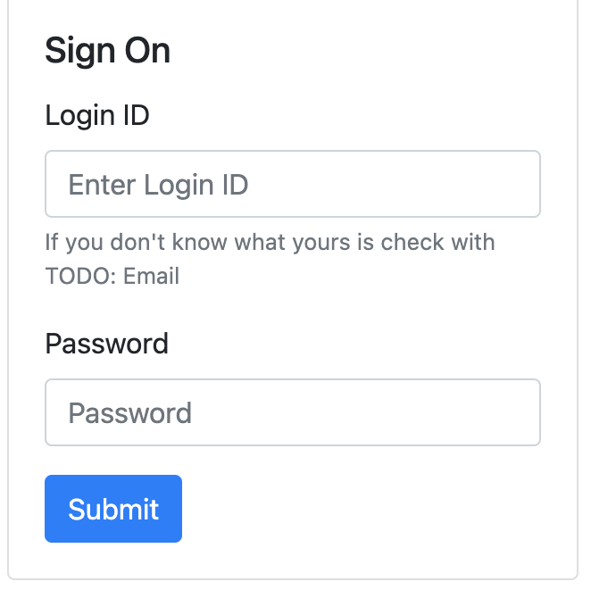

# User Manual for T27 Fundraising App V2.0

Welcome to the V2 Fundraising Experience.
Improvements
- Usable on mobile devices
- Progressive Web App which means that it is able to be installed and launched like a regular app for both phone and dekstop
- Initial releases targets latest Firefox/Chrome browsers.  (Internet Explorer and Safari Desktop are not yet supported)
- Support for more than just Mulch fundraising efforts

# How to get there
_TBD: Add Link_

# Authentication
As in prevous years you will need to get your Username and Password from the Fundraising Cooredinator

Enter your given username and password and click the Submit button.

# Start page
After you sign in the first page you will wind up on is the summary page.

From here there is a Navigtion bar at the top.
- "Home": Takes you back to the Summary Page
- "Orders": Brings up the order list view to see your previously submitted orders.
- "Report Issue": For filing a report if you have any issues with this application
- Your UserId: Click on your user id in the right hand corner to get a dropdown where you can signout if you are sharing a device and need to sign in as another user
- "Active Order":  If you have started a new order or are editing a previous order then there will be an "Active Order" option which will take you to the order edit page.

The summary information on this page will show you where you and your patrol stands in comparison with the rest of the troop.

The **[+]** in the lower right hand corner of the browser is how you add new orders.  If you have any "Active" order then clicking on this will discard changes to that order and start a new order.

# Orders List Page
Displays a list of the orders that you have entered

From this page you can edit or delete already entered order.  These Delete option will not be avaiable if the there are orders that have passed the cutoff date. However the edit button will be availble if there is a need to change the delivery address.  Or in the case of the mulch fundraiser which multiple delivery dates then orders for a specific delivery day can be edited removed until after the cutoff time for that delivery date.

If you do need to delete an order then a confirmation box will come up in which you have to enter "delete" to cause the order to be deleted

The **[+]** in the lower right hand corner of the browser is how you add new orders.  If you have any "Active" order then clicking on this will discard changes to that order and start a new order.

# Order Edit Page
From this page you an add product orders or donations.

This is an example of an new/or edit of existing order that has 1 order for a specific delivery date. 
The "Add Product" [+] button can be used to add an order for a different delivery date.
The "Add Donation" [+] button can be used to add a donation to the order

For the existing order you can click on the pencil button to edit that product order or the [X] button to delete the order.

_For the wreath fundraiser the neighborhood field would not be present and there would be additional fields for putting in city/state/zip_

# Add Product Page
This page is where you would add or edit product specific entries for the order.  The contents of this page will change depending on the active fundraising type (Wreath/Mulch/Other)

The delivery date pull down will allow you to select the delivery data for the fundraiser order.
The rest of the options are going to be fundraiser specific.

# Add Donation Page
This page allows for donations to be added or edited. 

